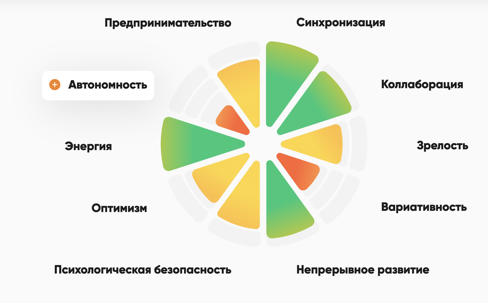

# Опросник с диаграммой результатов

Интерактивный опросник с визуализацией результатов в виде красивой диаграммы. Проект позволяет пользователям пройти опрос по 5 разделам, оценивая каждый вопрос по шкале от -5 до 5, и получить наглядное представление результатов.



## Функциональность

- 5 разделов по 7 вопросов в каждом
- Оценка каждого вопроса по шкале от -5 до 5
- Визуализация результатов в виде полярной диаграммы
- Административный интерфейс для редактирования вопросов
- Сохранение данных в локальном хранилище браузера

## Технологии

- HTML5
- CSS3
- JavaScript (ES6+)
- Chart.js для визуализации данных
- Express.js для локального сервера

## Установка и запуск

### Предварительные требования

- Node.js (версия 14.x или выше)
- npm (обычно устанавливается вместе с Node.js)

### Шаги по установке

1. Клонируйте репозиторий:
   ```bash
   git clone git@github.com:2heoh/trust-quiz.git
   cd trust-quiz
   ```

2. Установите зависимости:
   ```bash
   npm install
   ```

3. Запустите локальный сервер:
   ```bash
   npm start
   ```

4. Откройте браузер и перейдите по адресу:
   ```
   http://localhost:3000
   ```

## Использование

1. На главной странице нажмите кнопку "Начать опрос"
2. Ответьте на все вопросы, используя слайдер для оценки
3. После завершения опроса вы увидите результаты в виде диаграммы
4. Для повторного прохождения опроса нажмите кнопку "Пройти снова"
5. Для доступа к административному интерфейсу нажмите кнопку "Администрирование" на главной странице

## Административный интерфейс

Административный интерфейс позволяет редактировать:
- Названия разделов
- Тексты вопросов

Все изменения автоматически сохраняются в локальном хранилище браузера.

## Структура проекта

- `index.html` - основной HTML файл
- `style.css` - стили проекта
- `quiz.js` - основная логика приложения
- `server.js` - файл для запуска локального сервера
- `images/` - директория с изображениями

## Лицензия

MIT 